##### 技術架構

###### 系統架構圖

###### 核心元件說明

- **User Interface**: 提供用戶與系統互動的入口，包含郵件內容輸入、上傳檔案等。
- **API Gateway**: 統一處理所有請求，包含 JWT 機制、Rate limit、請求驗證與 /generate 呼叫。
- **Auth Service**: 產生與驗證 JWT，保護 API 存取權。
- **LLM Service**: 整合 OpenAI 等 LLM 服務，提供內容生成與分析。
- **LLM Worker Process**: 處理從 Kafka 接收的任務，呼叫 LLM API 並處理回應。
- **Kafka Queue System**: 作為非同步任務分派通道，避免前後端阻塞。
- **PostgreSQL Database**: 儲存任務紀錄、使用者紀錄與分析結果。
